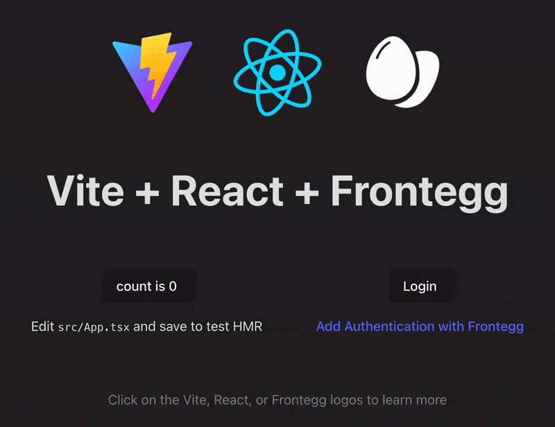
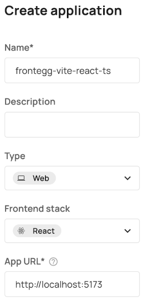

# frontegg-vite-react-ts

<p align="center">
  <a href="https://frontegg.com" target="_blank" rel="noopener noreferrer">
    
  </a>
</p>

## Vite React w/ Typescript and Frontegg

This is a minimal sample app to get started with [Frontegg](https://frontegg.com) Authentication in a
React app using [Frontegg&#39;s React SDK](https://github.com/frontegg/frontegg-react).

The app is bootstrapped with [Vite](https://vite.dev/) and their
[React template (with Typescript)](https://github.com/vitejs/vite/tree/main/packages/create-vite/template-react-ts), but [Frontegg&#39;s React SDK](https://github.com/frontegg/frontegg-react) can be used in any client-side React app.

## Configuring Frontegg

### Frontegg Application Configuration

[Create](https://developers.frontegg.com/guides/management/multi-apps/overview#create-and-configure) or start with an existing Frontegg Application.
And, configure as follows:

- `Type = Web`
- `Frontend stack = React`
- `App URL = http://localhost:5173`

  - the url should match the url where you're app is running
  - `http://localhost:5173` is the default url in Vite in development mode,
    modify as needed

  <details>
   <summary>Create a new application config in the dashboard</summary>
   <picture>
      <source srcset="public/readme/CreateNewApplicationConfig.webp 284w, public/readme/CreateNewApplicationConfig-2x.webp 451w" sizes="(max-width: 800px) 284px, 451px" type="image/webp" />
      
    </picture>
  </details>

### Don't forget to add your `redirect uri`!

Under `Configurations` > `Authentication` > `Login Method` in your **Frontegg dashboard**,
add a url back to your app.

For example, when running in Vite dev mode`<sup>`\*`</sup>` (a.k.a `npm run dev`):

```plaintext
http://localhost:5173/oauth/callback
```

<sup>\*</sup>Modify the hostname and port as needed if you've changed from the defaults or are running in other modes.

### Environment Variables

`.env.Example` contains the required Frontegg config values used in the app.

To use the template,

1. create a copy of the file and name it `.env`
   - Vite uses [dotenv](https://github.com/motdotla/dotenv) to automatically [load the variables in the `.env` file](https://vite.dev/guide/env-and-mode.html#env-files)`<sup>`\*`</sup>`
2. replace the placeholder values with your Frontegg details

There are 3 environment variables necessary for a basic Frontegg-React integration:

1. `VITE_FRONTEGG_BASE_URL`
2. `VITE_FRONTEGG_CLIENT_ID`
3. `VITE_FRONTEGG_APP_ID`

<details>

<summary><a href=".env.example">`.env`</a> Template</summary>

```shell
################################################################################
### FRONTEGG CONFIG ###
################################################################################
# ! The 'VITE_' prefix exposes values client-side. !
# This is necessary for Base URL, Client ID, and App ID for the Frontegg React SDK, but take care
# not to expose any secrets!
#
#
# The "Base URL" and "Client ID" values can be found in the Frontegg Dashboard
# under "Keys & Domains".
#
# "Keys & Domains" > "Domains" > "Domain Name"
# Under "Domains" tab, in the "Frontegg Domain" section labeled as the
# "Domain Name"
VITE_FRONTEGG_BASE_URL='https://app-rndCharsHere.frontegg.com'
#
# "Keys & Domains" > "General" > "Client ID"
# Under "General" tab, in the "API Key" section labeled as the "Client ID"
VITE_FRONTEGG_CLIENT_ID='looks-like-a-rnd-uuid'
#
#
# App ID's are unique per application and can be found under Applications in the Frontegg Dashboard.
#
# "Applications" > {name_of_app} > "Settings" > "App ID"
# Under the "Settings" tab labeled as the "ID"
VITE_FRONTEGG_APP_ID='looks-like-a-rnd-uuid-too'
#
################################################################################
### FRONTEGG CONFIG ###
################################################################################
```

</details>

<br/>

> [!CAUTION] &nbsp;&nbsp; <sup>\*</sup> The 'VITE_' prefix exposes environment variables client-side!
> This is what we want for the 3 variables above, but be careful when adding more! And, make sure you add it to your `.gitignore` if you add any sort of secrets.

## Install

Install required packages with npm:

```shell
npm install
```

## Running the App

Start the dev server as you would with any Vite React app by running:

```shell
npm run dev
```

In your browser, navigate to http://localhost:5173 (or the url given by Vite from the above command).

## If Everything Goes Smoothly 🤞

### The Vite React Template **_Plus_**

 +  + 

When you open your running app in the browser, you should something very similar to the gif at the top of this readme, i.e., the Vite React template with the Frontegg logo added along with a login button.

### Testing out Frontegg Auth + More

#### Creating an Account and User to Authenticate

You'll need an **Account** with a **User** to try Authentication (a.k.a. try logging in)!

Here's how:

##### If you haven't created an **Account** yet:

1. Under `Management > Accounts` in the dashboard, create a new [Account](https://developers.frontegg.com/guides/management/manage-accounts/overview).
2. Open your newly created `Account` and click on the `Applications` tab.
3. If you don't see your Application here:
    1. Click on `Assign applications` to allow users in this **Account** to authenticate via your **Application**.[1]
    2. Select the Application configuration which you're using.

##### Create a new user:

1. Under `Management > Users` (or on the Users tab of an Account), click the `Create user` button.
   1. Make sure your app is added to the list of Applications in the create user modal. It needs to be assigned to this Account first, though.
   2. And, if you started from the Users page, make sure you add the Account you're using to the list in the modal.
   3. Inviting by email provides an easy way to start testing. Once you've successfully created the user, you'll receive a link to the corresponding email to activate the account.

#### Well, don't be shy, now! Try it out!

- Clicking the login button should redirect you to your Frontegg login page.

  - This is what's referred to as the "Hosted Login". You can change the UI using the "Login Builder" found in the dashboard.

- After successfully authenticating, you should be brought back to the app (localhost:5173),
  - With a small difference indicating you've logged in!
    - The "Login" button should be replaced with a "Logout" button and the email of the user you just authenticated with.

## Resources

To help make it easier to focus on the pieces relevant for integrating Frontegg, this sample app is
basically the Vite React (Typescript) Template with a few additions. [The Vite.dev docs](https://vite.dev/guide/#scaffolding-your-first-vite-project) are a great place to start if you want to learn more about the surrounding "non-Frontegg" pieces.

[@frontegg/react Docs](https://developers.frontegg.com/sdks/frontend/react/hosted-login)
[@frontegg/react on npm](https://www.npmjs.com/package/@frontegg/react)
[Frontegg's Hosted Login Page Intro](https://developers.frontegg.com/guides/login-box/intro)
[Free Trial Signup](https://portal.frontegg.com/signup)  
[Slack Channel](https://join.slack.com/t/frontegg-community/shared_invite/zt-e1oxi1vn-SZErBZcwHcbgj4vrwRIp5A)  
[Frontegg on GitHub](https://github.com/frontegg)

[1]: https://developers.frontegg.com/guides/management/multi-apps/apps-accounts-management
