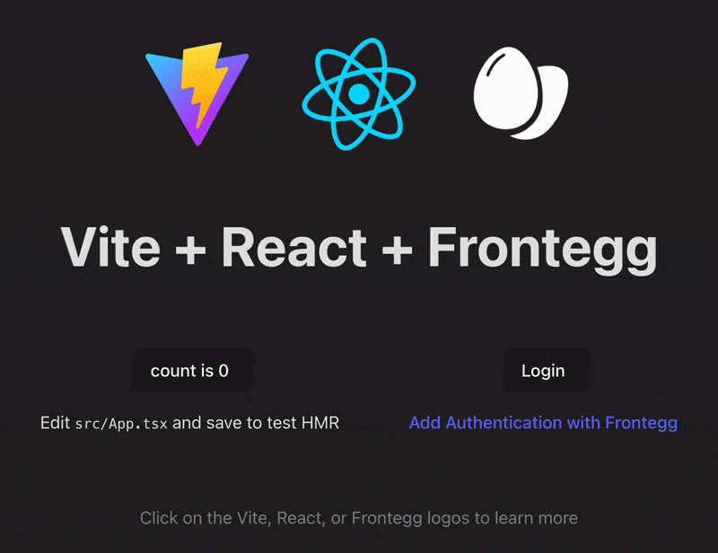
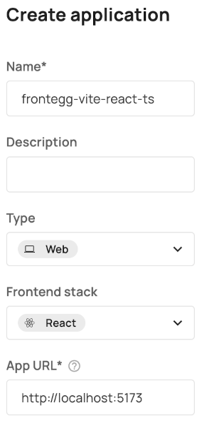

# frontegg-vite-react-ts

<p align="center">
  <a href="https://frontegg.com" target="_blank" rel="noopener noreferrer">
    
  </a>
</p>

## Vite React w/ Typescript and Frontegg

This is a minimal sample app to get started with [Frontegg](https://frontegg.com) Authentication in a React app using [Frontegg&#39;s client-side React SDK](https://github.com/frontegg/frontegg-react).

The app is bootstrapped with [Vite](https://vite.dev/) and their [React template (with Typescript)](https://github.com/vitejs/vite/tree/main/packages/create-vite/template-react-ts), but [Frontegg&#39;s React SDK](https://github.com/frontegg/frontegg-react) can be used in any client-side React app.

## Configuring Frontegg

### Frontegg Application Configuration

[Create](https://developers.frontegg.com/guides/management/multi-apps/overview#create-and-configure) or start with an existing Frontegg **Application**.

And, configure the following options:

- **Type** = `Web`
- **Frontend stack** = `React`
- **App URL** = `http://localhost:5173`
  - the url where you're app is running
  - `http://localhost:5173` is the default url in Vite development mode (a.k.a. when running `npm run dev`)

  <details>
   <summary>ℹ️ Creating a new application config in the dashboard</summary>
   <picture>
      <source srcset="public/readme/CreateNewApplicationConfig.webp 284w, public/readme/CreateNewApplicationConfig-2x.webp 451w" sizes="(max-width: 800px) 284px, 451px" type="image/webp" />
      
    </picture>
    <br/>
    The App URL should point to wherever you'll be running this App (which with Vite's dev server is `http://localhost:5173`).
  </details>
  
### Don't forget to add your `redirect uri`!

Under `Configurations` > `Authentication` > `Login Method` in your **Frontegg dashboard**, add a url back to your app.

For example, when running in Vite dev mode<sup>\*</sup> (a.k.a `npm run dev`):

```plaintext
http://localhost:5173/oauth/callback
```

<sup>\*</sup>Modify the hostname and port as needed if you've changed from the defaults or are running in other modes.

### CORS & Allowed Origins

If you don't configure this, you may open your browser's console to see a bunch of ['CORS'](https://developer.mozilla.org/en-US/docs/Glossary/CORS) errors that say something like:

```plaintext
Cross-Origin Request Blocked: 
The Same Origin Policy disallows reading the remote resource at 
https://app-abc123.frontegg.com/frontegg/oauth/token.
(Reason: CORS header ‘Access-Control-Allow-Origin’ missing). 
Status code: 204.
```

The solution is to add your app's [origin](https://developer.mozilla.org/en-US/docs/Glossary/Origin) as an 'Allowed Origin' which lets Frontegg know that it's okay to share (potentially) sensitive information there.

#### How to Configure Allowed Origins in the Frontegg Dashboard

Under `Configurations` > `Keys & domains` > `Domains` tab > `Allowed Origins` section in your **Frontegg dashboard**, add your app's origin (the scheme, domain, and port parts of the url: e.g., <http://localhost:5173> or <https://example.com>).

### Environment Variables

There are 3 environment variables necessary for a basic Frontegg-React integration:

1. `VITE_FRONTEGG_BASE_URL`
2. `VITE_FRONTEGG_CLIENT_ID`
3. `VITE_FRONTEGG_APP_ID`

`.env.Example` contains the required Frontegg variables used in the app that you can use by simply swapping in your actual config values for the placeholder values.

To use the template,

1. create a copy of the file and name it `.env`
   - Vite uses [dotenv](https://github.com/motdotla/dotenv) to automatically [load the variables in the `.env` file](https://vite.dev/guide/env-and-mode.html#env-files)<sup>\*</sup>
2. replace the placeholder values with your Frontegg details:
   1. The "Base URL" and "Client ID" values can be found in the Frontegg Dashboard under "Keys & Domains".
      1. `VITE_FRONTEGG_BASE_URL`
         - "Keys & Domains" > "Domains" tab, in the "Frontegg Domain" section labeled as the "Domain Name"
      2. `VITE_FRONTEGG_CLIENT_ID`
         - "Keys & Domains" > "General" tab, in the "API Key" section labeled as the "Client ID"
      3. `VITE_FRONTEGG_APP_ID`
         - App ID's are unique per application and can be found by opening a particular Application in the Frontegg Dashboard.
         - "Applications" > {name_of_app} > "Settings" tab labeled as the "ID"

#### The `.env` file Template

<details>

<summary>ℹ️ Expand to view <a href=".env.example">.env</a> Template</summary>

```shell
################################################################################
### FRONTEGG CONFIG ###
################################################################################
# ! The 'VITE_' prefix exposes values client-side. !
# This is necessary for Base URL, Client ID, and App ID for the Frontegg React SDK, but take care
# not to expose any secrets!
#
# The "Base URL" and "Client ID" values can be found in the Frontegg Dashboard
# under "Keys & Domains".
#
# "Keys & Domains" > "Domains" > "Domain Name"
# Under the "Domains" tab, in the "Frontegg Domain" section labeled as the "Domain Name"
VITE_FRONTEGG_BASE_URL='https://app-rndCharsHere.frontegg.com'
#
# "Keys & Domains" > "General" > "Client ID"
# Under "General" tab, in the "API Key" section labeled as the "Client ID"
VITE_FRONTEGG_CLIENT_ID='looks-like-a-rnd-uuid'
#
#
# App ID's are unique per application and can be found by opening a particular Application in the
# Frontegg Dashboard.
#
# "Applications" > {name_of_app} > "Settings" > "App ID"
# Under the "Settings" tab labeled as the "ID"
VITE_FRONTEGG_APP_ID='looks-like-a-rnd-uuid-too'
################################################################################
### FRONTEGG CONFIG ###
################################################################################
```

</details>

<br/>

> [!CAUTION] &nbsp;&nbsp; <sup>*</sup> The 'VITE_' prefix exposes environment variables client-side!
> <details><summary>🤫 Be careful not to expose any secrets! </summary> This is what we want for the 3 variables above, but be careful when adding more! And, make sure you add it to your `.gitignore`, if using git for source control and a public repo, if you add any sort of secrets to avoid accidentally publishing.</details>

## Install

Install required packages with npm:
<sup>*yarn v2+ may cause some strange and seemingly unrelated errors when trying to run the app. It's currently being investigated. It's suggested to use `npm` for now</sup>

```shell
npm install
```

## Running the App

Start the dev server as you would with any Vite React app by running:

```shell
npm run dev
```

In your browser, navigate to `http://localhost:5173`<sup>*</sup>
<sup>*or the url printed by Vite once running</sup>

## If Everything Goes Smoothly 🤞

 +  + 

You should see the vite React template...  *plus a little more*

When you open your running app in the browser, you should land on a page that looks like the gif at the top of this readme, i.e., the Vite React template PLUS some Frontegg parts like the logo and `login` button.

*If you need help creating a Frontegg **Account** with a **User** with the **Application** assigned, check out the next section for help!

Clicking on the `login` button should bring you to your login page, customizable via the [Login Box Builder](https://developers.frontegg.com/guides/login-box/intro) in the admin portal.

 After successfully logging in, you should be redirected back to the original page with the `login` button replaced with a `logout` button and the logged in user's email displayed.

## Trying it Out!

To test it out (a.k.a. to try logging in), you'll need an **Account** with a **User**!

### Create an 'Account'

1. Under `Management` > `Accounts` in the dashboard, create a new [Account](https://developers.frontegg.com/guides/management/manage-accounts/overview).
2. Open your newly created `Account` and click on the `Applications` tab.
3. If you don't see your Application here:
    1. Click on `Assign applications` to allow users in this **Account** to authenticate via your **Application**.[1]
    2. Select the Application configuration which you're using.

### Create a user:

1. Under `Management > Users` (or on a specific **Account's** page under the `Users` tab), click the `Create user` button.[2]
   1. Make sure your app is added to the list of Applications in the create user modal. It needs to be assigned to this Account first, though, otherwise it won't be available to select.
   2. And, if you started from the `Users` page, make sure you add the **Account** you're using to the list in the modal.
      1. Starting from the `Users` tab of a specific **Account** connects the user to that **Account** right away.
   3. Inviting by email provides an easy way to start testing. Once you've successfully created the user, you'll receive a link to the corresponding email to activate the account.[3]

### Run the app and login!

Run the app (e.g., `npm run dev`) and open the app in a browser where you should see a page with the three logos and some stuff below ([image shown at the top](#frontegg-vite-react-ts)).

- Clicking the login button should redirect you to your Frontegg login page.
  - This is what's referred to as the "Hosted Login" (as opposed to the "Embedded Login"[4]). You can change the UI using the "Login Builder" found in the dashboard.

- After successfully authenticating, you should be brought back to the app (localhost:5173 in dev mode),
  - With a small difference indicating you've logged in!
    - The `Login` button should be replaced with a `Logout` button and the email of the user you just authenticated with.

## What to do in case...

### First Debug Steps

There are a lot of different values that are usually mostly random strings used in a lot of different places, so it's easy to accidentally use the wrong value for several reasons.

Double check the following are match between your code and what's in the Frontegg dashboard:

- Environment Variables
- App URL
- `redirect_uri` (more below)

### `redirect_uri` not found

Hit the dreaded `redirect_uri` not found error? Don't worry, everyone using OAuth 2/OIDC hits at some point. I can't seem to get enough of it. But, it's an important part of how the security of  [OAuth 2](https://datatracker.ietf.org/doc/html/rfc6749), and therefore [OIDC](https://openid.net/specs/openid-connect-core-1_0.html) (OIDC is a layer built on top of OAuth 2), works

First, check that everything looks as expected from the step above in the `Configuring Frontegg` section: [*Don't forget to add your `redirect_uri`!*](#dont-forget-to-add-your-redirect-uri)

### User is not associated with the requested application

This means the User you tried signing in with belongs to an Account which doesn't have the Application linked. In other words, the Application with the corresponding App ID you used for the `Client ID` in the environment variables needs to be assigned to an Account which the User belongs to.
If you're user does belong to an Account where the Application is linked. Find the User and open the context menu (3 dots at the end of the User's row) and click `Edit applications` and assign the corresponding Application. This can happen if the Application is assigned to the Account *after* the User was already added there.

## Resources

### Frontegg

[@frontegg/react Docs](https://developers.frontegg.com/sdks/frontend/react/hosted-login)
[@frontegg/react on npm](https://www.npmjs.com/package/@frontegg/react)
[Frontegg's Hosted Login Page Intro](https://developers.frontegg.com/guides/login-box/intro)
[Free Trial Signup](https://portal.frontegg.com/signup)  
[Slack Channel](https://join.slack.com/t/frontegg-community/shared_invite/zt-e1oxi1vn-SZErBZcwHcbgj4vrwRIp5A)  
[Frontegg on GitHub](https://github.com/frontegg)

### Minimal React Sample

To help make it easier to focus on the pieces relevant for integrating Frontegg, this sample app is simply the Vite React (Typescript) Template with a few additions. [The Vite.dev docs](https://vite.dev/guide/#scaffolding-your-first-vite-project) are a great place to start if you want to learn more about the surrounding "non-Frontegg" pieces.

### Other

[What is OpenID Connect](https://openid.net/developers/how-connect-works/)

[1]: https://developers.frontegg.com/guides/management/multi-apps/apps-accounts-management
[2]: https://developers.frontegg.com/guides/management/multi-apps/apps-users-management
[3]: https://developers.frontegg.com/guides/management/manage-users/user-invitation
[4]: https://developers.frontegg.com/guides/env-settings/hosted-embedded
